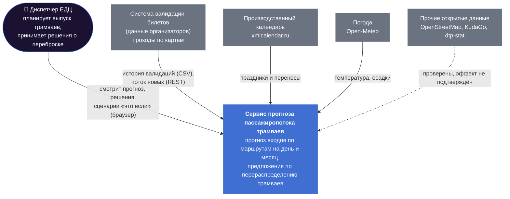
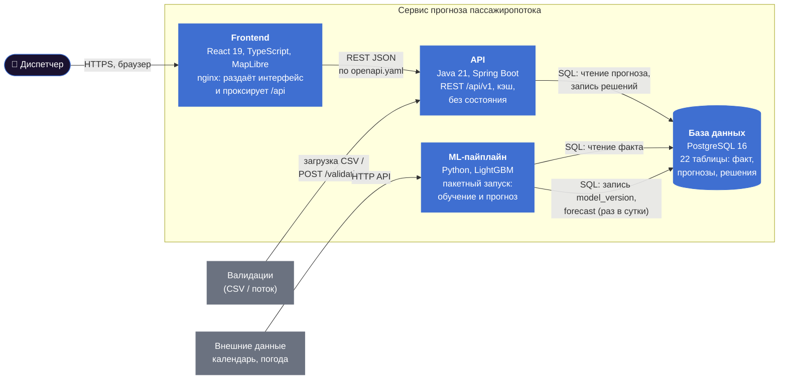
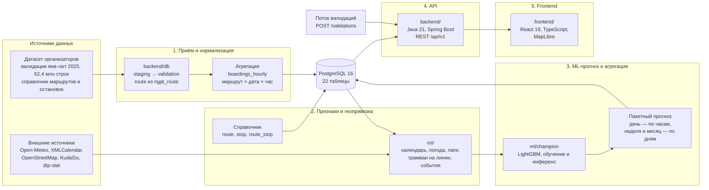

# Архитектура и модули

Сервис прогноза пассажиропотока трамваев для диспетчеров ЕДЦ ГУП «Московский метрополитен».
Решение разделено на пять модулей: приём и нормализация данных → признаки и геопривязка → ML-прогноз
и агрегация → API → frontend. Модули общаются через базу данных PostgreSQL и REST API по единому
контракту (`docs/openapi.yaml`).

## Модель C4

Архитектура описана по модели C4 — на двух уровнях приближения: сначала система целиком и её окружение,
затем части, из которых она состоит.

### Уровень 1. Контекст системы

Кто пользуется системой и с какими внешними системами она связана.

### Уровень 2. Контейнеры

Из каких отдельно запускаемых частей состоит система и как они обмениваются данными.

| Контейнер | Ответственность | Почему так |
|---|---|---|
| Frontend | Интерфейс диспетчера | nginx проксирует `/api` на бэкенд — фронт и API на одном адресе, без проблем с CORS |
| API | Отдаёт прогноз, принимает решения и поток валидаций | Не считает модель, только читает готовое — быстрый ответ; без состояния — масштабируется копиями |
| База данных | Единое хранилище факта, прогнозов, решений | Все модули общаются через неё и через API — нет прямых связей между Python и Java |
| ML-пайплайн | Обучение и пакетный прогноз | Тяжёлые вычисления вынесены из пути запроса пользователя; новая версия модели — новая запись в `model_version` |

Уровень 3 (компоненты внутри модулей) — в схеме и таблице модулей ниже. Уровень 4 (код и таблицы) —
в разделе «Схема базы данных» и в `sql/01_create_tables.sql`.

## Общая схема

## Модули

| № | Модуль | Папка | Технологии | Вход | Выход | Ответственный |
|---|---|---|---|---|---|---|
| 1 | Приём и нормализация данных | `backend/db/`, `sql/` | PostgreSQL 16, psql COPY | CSV валидаций (разделитель «;»), справочник | Таблицы `validation`, `boardings_hourly` | Артём |
| 2 | Признаки и геопривязка | `ml/` | Python 3.11+, pandas / DuckDB | `boardings_hourly`, справочник, внешние API | Признаки модели: календарь, погода, лаги, трамваи на линии, события, окружение остановок | Ярослав |
| 3 | ML-прогноз и агрегация | `ml/champion/` | LightGBM, scikit-learn | Признаки | Таблицы `model_version`, `forecast`, `model_quality`, `factor_contribution`; CSV-сабмит | Ярослав |
| 4 | API | `backend/` | Java 21, Spring Boot, springdoc-openapi | Таблицы БД | REST API `/api/v1`, 11 методов по контракту | Артём |
| 5 | Frontend | `frontend/` | React 19, TypeScript 5, MapLibre, React Query | REST API | Дашборд диспетчера: обзор, карта, маршрут, решения, «что если», качество, выгрузка | Сергей |

Сквозные артефакты: контракт API `docs/openapi.yaml`, схема БД `sql/01_create_tables.sql`,
договорённости команды `CLAUDE.md`.

## Потоки данных

| Поток | Как работает | Частота |
|---|---|---|
| **Пакетный: обучение и прогноз** | Модуль 1 загружает валидации и считает `boardings_hourly` → модуль 2 собирает признаки с внешними данными → модуль 3 обучает модель и записывает прогнозы в `forecast` с новой версией в `model_version` | При поступлении новых данных; по расписанию (раз в сутки) |
| **Онлайн: чтение прогноза** | Фронт вызывает API → API читает готовые строки из `forecast` активной версии модели → ответ JSON | По запросу пользователя |
| **Потоковый: приём валидаций** | Внешняя система отправляет пакеты до 5000 записей в `POST /validations` → запись в `validation` (source = stream) → обновление `boardings_hourly` | Непрерывно (для демо — скрипт-имитатор из истории) |

## Схема базы данных

Упрощённая схема — 9 ключевых таблиц из 22, только главные поля:

| Группа | Таблицы | Роль |
|---|---|---|
| Справочники | `route`, `stop` | Маршруты и остановки |
| Факт | `validation`, `boardings_hourly` | Сырые валидации и почасовой поток — цель прогноза |
| Внешние факторы | `calendar_day`, `weather` | Тип дня и погода — признаки модели |
| Прогноз | `model_version`, `forecast` | Версии модели и готовые прогнозы, которые читает API |
| Решения | `decision` | Предложения диспетчеру по перераспределению трамваев |

Полная схема (22 таблицы, ключи, ограничения, индексы) — `sql/01_create_tables.sql`.

## Ключевые архитектурные решения

| Решение | Почему |
|---|---|
| **Прогноз считается заранее**, API только читает готовые строки | Модель не вызывается на каждый запрос → время ответа определяется чтением из БД; цель p95 < 300 мс при сотнях RPS |
| **API без состояния** (stateless) | Можно запустить несколько копий за балансировщиком (`docker compose up --scale backend=N`) — горизонтальное масштабирование |
| **Версии модели** (`model_version.is_active`) | Новую модель можно подготовить заранее и переключить одной записью; можно откатиться |
| **Единый контракт** `docs/openapi.yaml` | Бэкенд генерирует интерфейсы, фронтенд — типы TypeScript; поля совпадают автоматически |
| **Единый формат ошибок** `{code, message, details}` | Понятные сообщения пользователю, 14 кодов ошибок в каталоге |
| **Кэш частых запросов** | Прогноз меняется раз в сутки — повторные запросы отдаются из памяти |
| **Внешние данные — отдельными загрузчиками** | Новый источник подключается без изменения модели и API |

## Развёртывание

Всё поднимается одной командой `docker compose up` (подробно — `docs/instrukciya-dlya-zhyuri.md`).

| Сервис | Что это | Порт |
|---|---|---|
| `db` | PostgreSQL 16; схема создаётся из `sql/01_create_tables.sql` при первом запуске | 5433 → 5432 |
| `backend` | API на Java; лимит ресурсов по требованиям — до 4 vCPU / 4 ГБ | 8080 |
| `frontend` | Дашборд диспетчера | [[порт после слияния]] |
| `loader` (по запросу) | Разовая загрузка полного датасета в БД: `docker compose run --rm loader` | — |

Настройки — через переменные окружения (`.env.example`): подключение к БД, норма пассажиров на трамвай (150),
время подготовки вагона к выпуску (40 минут).

## Соответствие критерию «Архитектура и производительность»

| Требование критерия | Как выполнено |
|---|---|
| Разделение на модули: приём → признаки → ML → API → frontend | Пять модулей в отдельных папках репозитория, схема выше |
| API отдаёт прогноз по маршруту, интервалу, горизонту | `GET /forecast?route=&date_from=&date_to=&hour_from=&hour_to=&horizon=` |
| Производительность и масштабируемость | Прогноз заранее + кэш + stateless API; замеры — в README |
| Запускаемый сервис | `docker compose up` |
