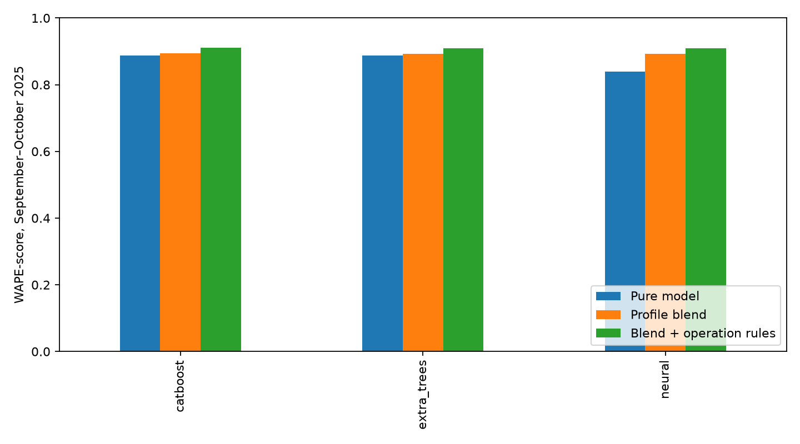

# Другие модели и официальные ограничения движения

Сравнение альтернативных моделей. Выбранный платформенный результат: [0,88724](FINAL_DELIVERY.md).

## Что проверено

CatBoost (900 деревьев, depth=6, MAE): прямая цель, остаток относительно профиля, нормализованный остаток. ExtraTrees: 48 деревьев с absolute_error. Нейросеть MLP 64→32→1: Adam, 80 эпох, взвешенная MAE, NumPy. Три набора признаков: климатология; фактическая суточная погода; фактическая почасовая погода + ДТП + мероприятия. Шесть весов смешивания с профилем.

Преобразование нормализованной цели: z=(y−profile)/scale, scale=max(profile,100), вес примера пропорционален scale. Поэтому scale×|z−z_hat| = |y−y_hat|: оптимизируется MAE в пассажирах. Log-target без компенсации весов не использовался.

Первый временной срез: январь–июнь → июль–август; второй: январь–август → сентябрь–октябрь. Внутри обучения профили строятся по предшествующим двухмесячным блокам. Маршрут 5 не оценивается. Часы 01–04 исключены из обучения, прогноз нулевой; час 05 сохранён. Метрика таблиц — WAPE-score по исходным labels, без восстановления проверочного факта.

## Результаты сентября–октября

| Семейство | Лучший чистый регрессор | Смешивание с профилем | Смешивание + режим движения |
|---|---:|---:|---:|
| catboost | 0.888243 | 0.893571 | 0.910989 |
| extra_trees | 0.887743 | 0.891824 | 0.909776 |
| neural | 0.838707 | 0.892007 | 0.909853 |

В строке чистый регрессор и смешивание могут иметь разные лучшие настройки. Выбор лучших настроек по сентябрю–октябрю — просмотренная валидация, не независимый тест.

Выбор только по июлю–августу: `climatology_extra_trees_normalized`, вес 0.75; его результат сентября–октября без отмен: **0.889784**.

Итоговый альтернативный кандидат: `climatology_catboost_residual`, вес 0.25; score до правил **0.893571**, только с отменами №50 **0.905032**, с отменами и сокращением №7 **0.910989**. Это модель плюс явное правило состояния маршрута. Результат этого CatBoost на платформе: **0,88506**; выбранный профиль + LightGBM с ограничениями получил **0,88724**.

## Найденная причина провалов и новый внешний источник

[Официальное сообщение от 5 сентября](https://t.me/DtOperativno/22624) объявляет отмену маршрута 50 по выходным с 6 сентября на время ремонта. [Сообщение от 15 ноября](https://t.me/DtOperativno/23565) подтверждает восстановление движения по выходным. Даты публикаций и SHA256 сохранены в `operational_sources.json`.

На неизменной модели Q&A применение этого правила даёт **0.891932 → 0.903240** на всей проверке сентября–октября. Это отдельный измеренный эффект информации о ремонте, а не выигрыш от смены алгоритма. Сами новости найдены после просмотра данных — поиск гипотез также может давать оптимистичную оценку.

**Исправление прежней интерпретации:** четыре дня маршрута 50 (7, 14, 21, 27 сентября), которые ранее восстанавливались как возможные потери связи, совпадают с официальной отменой движения. В новом варианте они не восстанавливаются. При финальном обучении профиль нормальной работы строится без дней отмен, затем применяется маска движения. Исходные labels не изменены.

Для №7 в те же выходные объявлена сокращённая трасса. Коэффициент снижения оценён взвешенной медианой отношения факта к прогнозу на 10 июля — 6 августа: [июльские работы и изменения маршрутов](https://transport.mos.ru/mostrans/all_news/125170). Получено 0.432482; степень переноса 0.75 выбрана из 0, 0.25, 0.5, 0.75, 1 на просмотренной валидации. Июльская и осенняя трассы не идентичны: это проверенная здесь гипотеза переноса, а не известный из объявления процент снижения потока.

Дата возобновления опубликована после 31 октября — здесь намеренно использована будущая внешняя информация. На ноябрь прогноз маршрута 50 зануляется 2, 8 и 9 ноября. Для рабочей субботы 1 ноября и праздничных 3–4 ноября нет отдельного подтверждения отмены: они оставлены рабочими в этой маске. Это ограничение интерпретации объявления, а не установленный факт расписания.

## Почему не вся утечка даёт большой прирост

Будущая погода, ДТП и события не содержат точного количества посадок; они могут объяснять лишь небольшую долю ошибки. Отмена конкретного маршрута имеет значительно более прямую связь с целью. Отдельно выполнена диагностика признаков из успешных валидаций самого предсказываемого часа:

| Диагностический вариант | WAPE-score |
|---|---:|
| control | 0.888074 |
| observed_exits | 0.891482 |
| validation_density | 0.911449 |

Это CatBoost normalized, 500 деревьев, без смешивания. Число наблюдаемых выходов и интервал между валидациями вычисляются из тех же событий, что и boardings. Это зависимые от цели признаки, а не независимый внешний источник. На ноябрь–декабрь их нет, поэтому они **не включены в сабмит**, а их качество не заявляется как качество доступного двухмесячного прогноза.

## Артефакты и повторение

`ml/artifacts/alternative_operations/`: модель, выбранный `test_submission.csv`, почасовые и суточные строки `forecast.csv`, предсказания валидации, SHA256. День — по часам, неделя/месяц — по дням; интервалы эмпирические, номинал 80%. Годовой горизонт не реализован. Предыдущий финальный сабмит не перезаписан.

```powershell
python -m pip install -r ml/requirements-experiments.txt
python -m ml.experiments.alternative_search --data PATH_TO_DATA --cache PATH_TO_CACHE
python -m ml.experiments.target_proxy_diagnostic --features ml/artifacts/alternative_search/features_validation_climatology.joblib --raw PATH_TO_HOURLY_VALIDATIONS --output ml/artifacts/target_proxy_diagnostic
python -m ml.experiments.alternative_delivery --data PATH_TO_DATA --cache PATH_TO_CACHE
python -m ml.experiments.alternative_report
```

Для запуска нужны входы предшествующего oracle-эксперимента, его исходный кэш и выпуск ml.qna (development_night_zero.csv для июльской калибровки). `--resume` продолжает только тот же прерванный поиск с неизменными входами и настройками.


