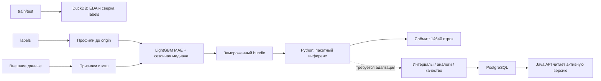

# Архитектура и область определения

- `champion/features.py`: профили, календарь, сезонность; обучающие блоки видят только предшествующую историю.
- `champion/external_data.py`, `accidents.py`: источники и ограничения дат.
- `champion/models.py`, `train.py`: L1-обучение, сравнение со средним baseline, сохранение отдельно от эталонной модели.
- `champion/runtime.py`: SHA256, загрузка, офлайн-инференс, полная сверка с эталоном.
- `audit_raw.py`, `data_audit.py`: сверка и EDA. `baseline.py`: средняя базовая модель.
- `postgres.py`, `postgres_aux.py`: валидация таблиц и транзакционная запись; прогноз эталонной модели ещё не дополнен всеми полями приложения.

Классы старого pickle `src.*` перенаправляются внутри загрузчика в `ml.champion.*`, без глобальной подмены модулей. Старый локальный `src/` для запуска не нужен.

ОДЗ: успешные входы в московские трамваи, маршруты 1, 5, 7, 11, 12, 17, 25, 26, 28, 50; все часы в московском времени. Bundle поддерживает 01.11–31.12.2025 при origin 31.10.2025. №5 без истории, качество по нему локально неизвестно. Не прогнозируются высадки, заполнение салона, остановки, внезапные закрытия или плановый выпуск. Максимум в истории — 5827 входов/час, не физический предел.

Новые даты требуют нового origin, истории, внешних данных и валидации. Новый маршрут без обучения может получать отдельно маркированный масштабированный профиль аналога, но такой согласованный режим в этом выпуске не реализован. Заполнение отсутствующей истории нулями не является адаптацией. Для №5 нужно завершить отдельную версию приложения с аналогами 1/7/11/12, сохранив конкурсный эталон.

Измерения Python-инференса и ограничения интеграции: [аудит требований](REQUIREMENTS_AUDIT.md), [performance.json](reports/performance.json). Для нового маршрута требуется отдельная проверка методом исключения известного маршрута; готовый универсальный перенос без переобучения в этом выпуске не реализован.
