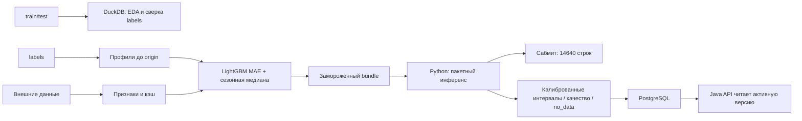

# Архитектура и область определения

- `champion/features.py`: профили, календарь, сезонность; обучающие блоки видят только предшествующую историю.
- `champion/external_data.py`, `accidents.py`: источники и ограничения дат.
- `champion/models.py`, `train.py`: L1-обучение, сравнение со средним baseline, сохранение отдельно от эталонной модели.
- `champion/runtime.py`: SHA256, загрузка, офлайн-инференс, полная сверка с эталоном.
- `audit_raw.py`, `data_audit.py`: сверка и EDA. `baseline.py`: средняя базовая модель.
- `postgres.py`, `postgres_aux.py`: валидация таблиц и транзакционная запись; новый qna-выпуск формирует forecast, model_version и model_quality; интеграция с живой БД не проверена.

Классы старого pickle `src.*` перенаправляются внутри загрузчика в `ml.champion.*`, без глобальной подмены модулей. Старый локальный `src/` для запуска не нужен.

ОДЗ: успешные входы в московские трамваи, маршруты 1, 5, 7, 11, 12, 17, 25, 26, 28, 50; все часы в московском времени. Bundle поддерживает 01.11–31.12.2025 при origin 31.10.2025. По Q&A №5 не прогнозируется и не оценивается из-за дефекта выгрузки; нули есть только как заполнители конкурсного CSV. Не прогнозируются высадки, заполнение салона, остановки, внезапные закрытия или плановый выпуск. Максимум в истории — 5827 входов/час, не физический предел.

Новые даты требуют нового origin, истории, внешних данных и временной валидации.
Автоматический перенос на произвольный новый маршрут в текущем выпуске не реализован;
исключение №5 по Q&A не является универсальным решением задачи отсутствующей истории.

`qna/cleaning.py`: нули 01–04, исключение №5, причинный детектор провалов.
`qna/pipeline.py`: выбор восстановления на июле–августе, оценка сентября–октября,
финальное обучение и калибровка интервалов. `qna/serving.py`: почасовая/суточная
детализация и ручные коэффициенты. `python -m ml.qna save-db` пишет неактивную версию;
`--activate` — явное переключение после проверки. Backend читает таблицы, модель не вызывает.

Для week/month хранятся дневные суммы (SQL horizon=month, hour=NULL);
для day — часы 0–23. №5 отсутствует в forecast, его статус содержится в route_availability.json.
[Полный контракт и запуск](QNA_UPDATE.md). Погода длинного горизонта — климатический прокси;
оперативный day-ahead режим с выпуском погодного прогноза до origin остаётся отдельной задачей.
