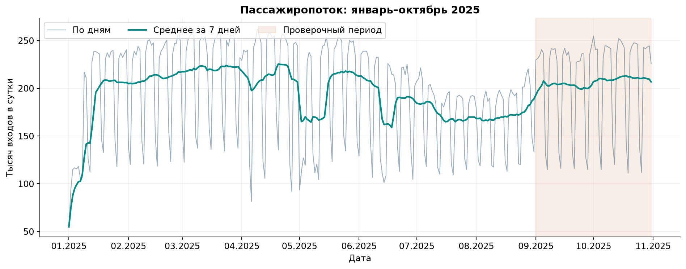
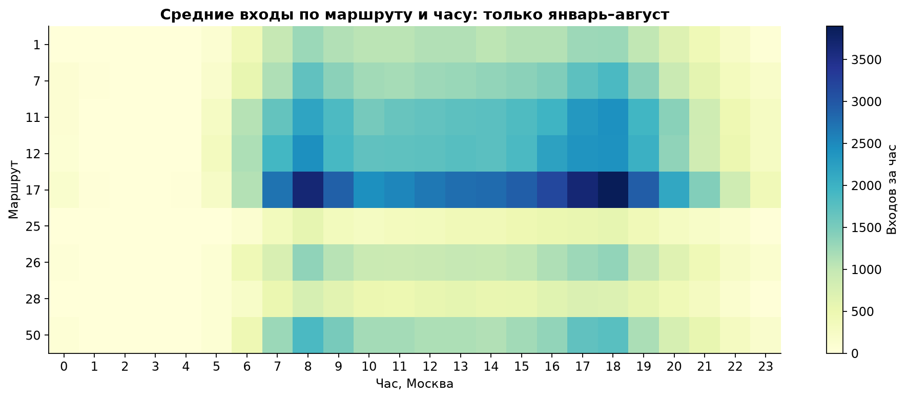
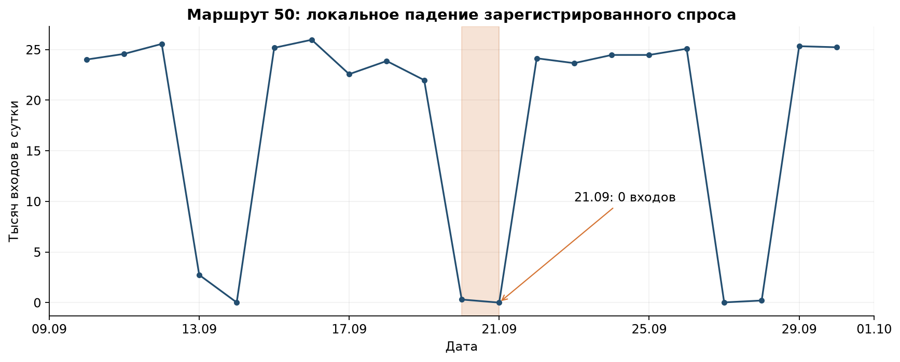

# Разведывательный анализ и качество данных

Проверены все **62 443 497 строк**: train 49 051 926, test 13 391 571, все 14 полей. DuckDB, ограничение памяти 2 ГБ, 4 потока; основной аудит ~223 с. Код [data_audit.py](data_audit.py), полный машиночитаемый [report.json](reports/data_quality/report.json), [сводка маршрутов](reports/data_quality/route_quality.csv), [аномальные часы](reports/data_quality/hourly_anomaly_candidates.csv).

## Целевая переменная и границы

Boardings — число строк `validation_result=1` по номеру маршрута, дате и часу **tran_date_time**. Успешных входов в январе–августе 46 912 710, в сентябре–октябре 12 754 481. С labels — ноль несовпадений ключей и значений. В train есть 523 успешные транзакции 1 сентября: они отнесены к проверке по времени. В test есть 562 успешные транзакции 1 ноября: они исключены из обучения и проверки. Имя файла не является границей времени.

У девяти известных маршрутов 304 × 24 × 9 = 65 664 часа; исходные агрегаты содержат 57 551 ключ, **8113 отсутствующих часов** восстановлены нулями после проверки определения labels. Это отсутствие успешных валидаций, а не доказанное отсутствие рейсов. Маршрут 5 отсутствует целиком. По Q&A отсутствие истории №5 вызвано проблемой выгрузки организаторов. Маршрут не оценивается; нули в сабмите служат заполнителем, в приложении — «нет данных».

## Пропуски и типы

| Поле | train: пропуски | test: пропуски | Обработка |
|---|---:|---:|---|
| begin_date_time | 4 794 872 | 1 346 639 | Не используется как время входа |
| pass_route | 22 516 456 | 6 037 285 | Поле взаиморасчётов перевозчиков; исключено из ML-признаков по Q&A |
| garage_number | 383 141 | 48 309 | Не используется для GPS/планового выпуска |
| bus_exit_no | 32 | 26 | NULL не считается отдельным наблюдаемым выходом |
| good_type | 49 | 23 | Неизвестный тариф, строковые правила не восстанавливают его |
| place_id | 155 | 0 | Не используется как остановка |

Пропусков критических target-полей не найдено. Невалидных чисел, дат и формата хеша карты не найдено. Хеши карт не включены в признаки/артефакты. Кардинальности в отчёте с суффиксом `approx_distinct` приблизительные; их нельзя читать как точные количества уникальных людей.

## Дубли и время

Проверены точные дубли всех 14 полей с hash-предфильтром и последующим точным сравнением кандидатов: **0**. Дубликатов ключей labels нет. Равенство маршрута/времени не означает дубль: несколько пассажиров могут пройти одновременно. Семантические дубли с различными техническими полями/повторные прикладывания не определяются без дополнительного правила организатора; target не дедуплицируется произвольно.

`input_date_time < tran_date_time`: 103 строки train, 0 test. `begin_date_time > tran_date_time`: 11 776 878 train, 3 314 417 test. Это флаги несогласованности времён и возможной семантики begin_date_time, не автоматический повод удалить посадки. Время начала не используется для таргета или утечки фактической будущей погоды.

## Аномалии и география

- Максимум известного часа — 5827 входов (№17). Обнаружены 80 кандидатов по отклонению от январь–август route×weekday×hour median/MAD, порог 8, минимальный масштаб 10. Это список для разбора, не автоматически ошибочные данные; строки не удалены.
- №50: **21.09.2025 весь день 0**, 20.09 только 304 входа, соседние обычные дни ~22–24 тыс. Возможны ограничения движения или потеря сбора. Причина не установлена; факт будущего нуля не включён в признаки.
- У публикуемой модели наибольшая относительная осенняя ошибка у №50, №25 и №7; общий score нельзя повышать исключением сложных маршрутов или дат. [Метрики именно этого выпуска](reports/champion/validation_by_route.csv).
- `place_id` — не остановка; GPS в транзакциях нет. В справочнике координаты доступны для 1/5/7/11/12; пересечение маршрутов с историей и координатами — 1/7/11/12. Маршруты с историей вне этого пересечения сохраняются в обучении и оценке. POI и геометрические признаки соседства в выбранной модели не используются.

## Политика качества

Ни реальные аномалии, ни неизвестные маршруты не исправляются догадками. В исходных данных №5 не наблюдается; по уточнению Q&A его качество не оценивается. Проверены форматы, диапазоны, границы времени, полная сетка, равенство labels, точные дубли, пропуски и наличие географической привязки. В выбранной модели погода — исторические месячные средние, не архив прогнозов. Это не подтверждает полноту датчиков или правдивость каждого внешнего события. Полный аудит referential integrity гаражных номеров относительно будущей таблицы vehicle не заменяет отдельную проверку справочника транспорта.

Географические исследования описывают аудит данных: дополнительные POI и восстановленные маршруты не включены в зафиксированную модель данного выпуска.

## Воспроизводимый EDA

[Выполненный ноутбук](notebooks/01_data_quality_and_eda.ipynb) содержит код, контрольные утверждения, таблицы и 7 графиков. [Манифест входов](reports/eda/manifest.json) фиксирует хеши агрегатов, [сверка raw и labels](reports/eda/raw_reconciliation.json) — результаты полного прохода. В ноутбуке не перечитываются 62,4 млн строк: полный проход воспроизводят `ml.audit_raw` и `ml.data_audit`.

**Выводы для моделирования:** профиль зависит от маршрута, часа и типа дня; поэтому нужен маршрутный baseline и календарные профили. Нулевые агрегаты надо отличать от полностью отсутствующего маршрута. Почти половина `pass_route` не заполнена; по Q&A это поле взаиморасчётов, а не надёжный признак пересадки, поэтому оно исключено из ML-витрины. Провалы №50 требуют отдельного мониторинга качества данных и движения; их удаление из проверки завысило бы оценку.

## Поправки после Q&A

Исходные проверки raw/labels сохранены: они относятся к полным успешным валидациям.
В новом обучении часы 01–04 зануляются как технологические; 05 остаётся без изменений.
`pass_route` не характеризует достоверно пересадку и исключён из признаков.
Хеш карты не используется как стабильный идентификатор пассажира.
Восстановление провалов проверяется только на истории, без изменения проверочного факта.
[Методика и четыре найденных кандидата №50](QNA_UPDATE.md).
