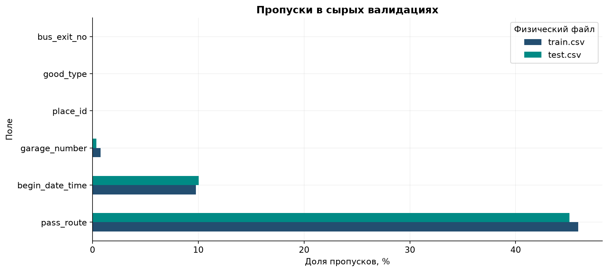
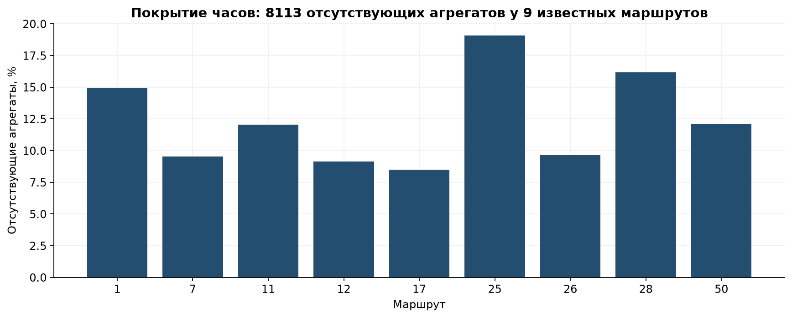
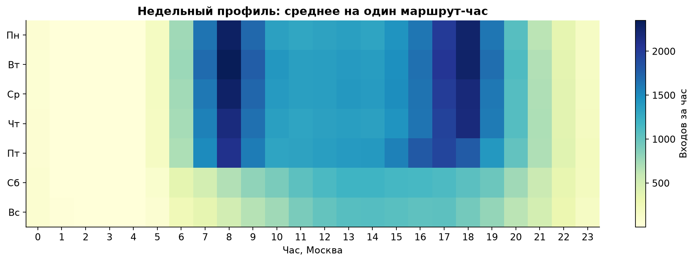
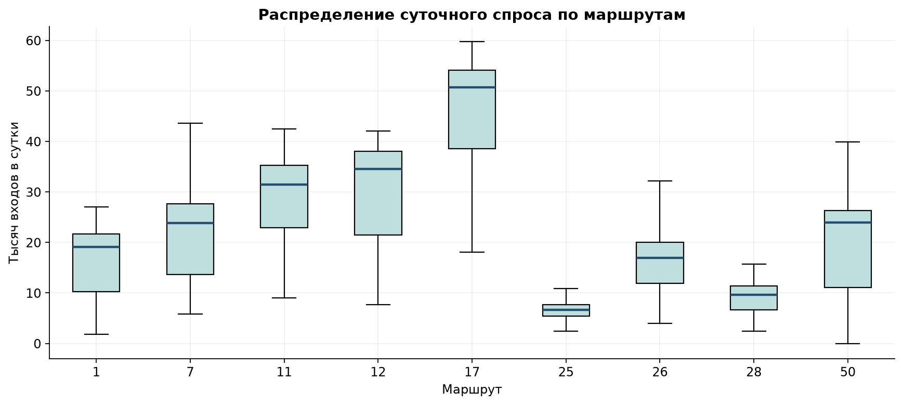
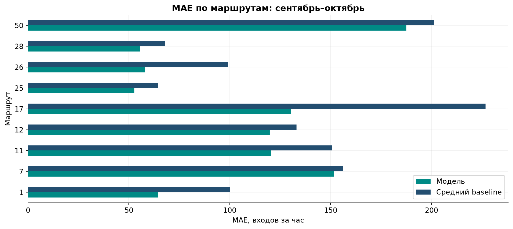
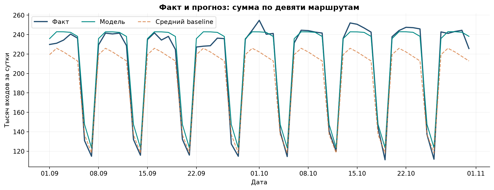
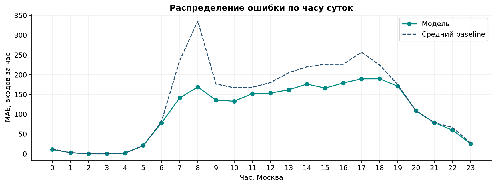
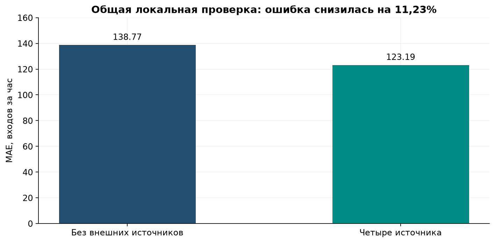
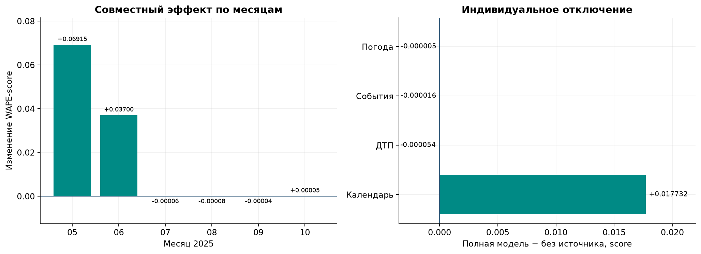
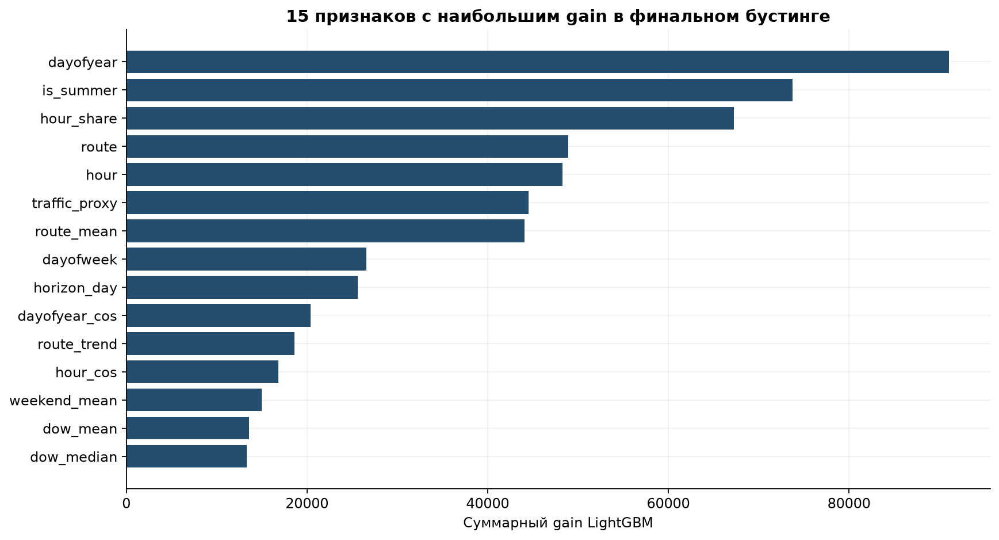

# Графики EDA и оценки модели

Графики построены из сохранённых агрегатов полного аудита и результатов валидации.
Код и таблицы: [EDA](../../notebooks/01_data_quality_and_eda.ipynb),
[оценка модели](../../notebooks/02_validation_and_external_sources.ipynb).
У каждого графика обозначены период, единицы измерения и область оценки.

## Качество данных и структура спроса

## Модель и внешние признаки

Общее сравнение без внешних источников и с четырьмя — все 39 744 проверочных часа
мая–октября. Дорожная эвристика и OSM исключены из обоих вариантов.

Следующий график относится к отдельной абляции: дорожная эвристика и OSM сохранены
в обоих сравниваемых вариантах. Он показывает неоднородность эффекта.

Gain показывает использование признаков деревьями, а не причинный вклад или прирост точности.

